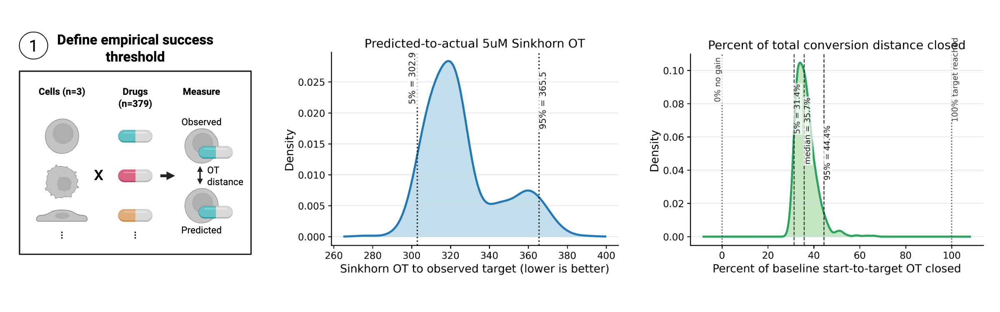

<p align="center">
  
</p>

<h1 align="center">PHAROS</h1>

<p align="center">
  <b>Perturbation-guided search for navigating therapeutic cell-state transitions</b>
</p>

# PHAROS

PHAROS is a framework that converts a trained single-cell perturbation model into a combinatorial drug screen.
PHAROS identifies combinatorial drug perturbations predicted to convert a
starting cell state into a target cell state. Unlike other models, PHAROS can be applied to datasets without any perturbations,
meaning any cancer single-cell dataset. The primary use case for PHAROS is to generate predictions
in cancer single-cell datasets that can then be experimentally evaluated. While combination therapy is central to oncology, 
experimentally screening all potential combinations is intractable, so we need a way to prioritize a certain set in-silico. 
Furthermore, this framework gives users full flexibility to decide with single-cell resolution the starting cell state
and the target cell state. 

<p align="center">
  
</p>

For a cancer dataset of interest, the user first needs to select a starting cell state and target cell state of interest.
For example: converting metastatic cells into primary cells, converting drug resistant cells into drug responsive cells, 
converting stage 4 cancer into stage 1 cancer, converting cancer stem cells into differentiated cells, converting 
immune resistant malignant cells into immune responsive malignant cells, converting melanoma cells with high EMT to 
melanoma cells with low EMT, converting cancer-associated fibroblasts into normal fibroblasts. With the advancement of 
single-cell technologies and bioinformatic analysis pipelines, there is a wealth of datasets that identify different
cellular states of primary tumors. Often with bulk-deconvolution and atlasses such as TCGA, scientists are able to 
identify certain cell states that correlate with poor overall or median survival. PHAROS gives researchers a data driven 
prediction of which drug combinations might convert those detrimental cell states into a less detrimental state.

The recommended workflow is:
1. establish that the proposed conversion is admissible;
2. test prespecified drugs or mechanisms in hypothesis-driven mode, or run an
   unbiased open search; and
3. interpret the generated reports and statistical evaluations.

PHAROS is being migrated from its original research scripts to an installable
command-line application. The current command tree can be inspected with:

```bash
uv tool install .
pharos --help
pharos --version
```

## STATE source and model prerequisites

PHAROS uses the model class provided by the
[Arc Institute STATE repository](https://github.com/ArcInstitute/state). To
keep PHAROS reproducible as STATE develops, clone and install the exact source
revision used for the validated analyses:

```bash
git clone https://github.com/ArcInstitute/state.git state
git -C state checkout --detach bf4fbc9ea35bf4d1e91afe201b663dec5d8bdd48
uv pip install --editable ./state
```

Run the installation command from the same activated Python environment in
which PHAROS is installed. Merely placing the repository in the working
directory is not sufficient; the editable installation makes its `src/state`
package importable. Confirm the installed version and source location with:

```bash
python -c "import importlib.metadata as m, state; print('arc-state:', m.version('arc-state')); print('state source:', state.__file__)"
```

The expected package version is `arc-state 0.10.5`, and `state source` should
point into the cloned `state/src/state/` directory. PHAROS imports
`state.tx.models.state_transition.StateTransitionPerturbationModel` directly
and performs conversion inference through its own GPU-aware converter. It does
not use STATE's embedding or transition-inference CLI scripts.

Two pretrained model repositories are used:

- **SE-600M** encodes expression data into the `X_state` embedding consumed by
  PHAROS. It is needed when a user's `.h5ad` has not already been embedded.
- **ST-SE-Tahoe** supplies the perturbation model that PHAROS uses to predict
  drug-induced state transitions.

These model artifacts are external and are not included in the PHAROS package.
Download the exact model revisions used for the validated analyses and verify
their SHA-256 checksums with:

```bash
pharos models download --output-dir ./models
```

The downloader is pinned to the following immutable Hugging Face revisions:

```text
arcinstitute/ST-SE-Tahoe  03b1971d7cc93a7535fd2e957c6948dba267378b
arcinstitute/SE-600M      5a9a80f44f7ce32ce57059933ef0d735d7c10ce5
```

Downloads are resumable through the Hugging Face cache. PHAROS verifies every
expected artifact against the checksums from the validated copies and writes
`models/pharos_model_manifest.json` with the model provenance. The command
finishes by printing four ready-to-copy environment-variable assignments:

```bash
export ST_RUN=/absolute/path/to/models/ST-SE-Tahoe/fewshot/state_generalization_X_state
export ST_CKPT=/absolute/path/to/models/ST-SE-Tahoe/fewshot/state_generalization_X_state/checkpoints/final.ckpt
export SE_DIR=/absolute/path/to/models/SE-600M
export SE_CKPT=/absolute/path/to/models/SE-600M/se600m_epoch16.ckpt
```

Copy those four lines into the current shell before running the examples below.
To download only one model, use `--component transition` for ST-SE-Tahoe or
`--component embedding` for SE-600M.

### Process a dataset of interest

Begin from an AnnData object whose `adata.X` contains raw gene counts. Remove
low-quality cells using criteria appropriate for the dataset, such as doublet
removal and filtering cells with high mitochondrial read fractions. Once cell
QC is complete, retain genes detected in at least three cells, normalize every
cell to 10,000 total counts, and apply a `log1p` transformation. Do **not**
restrict the matrix to highly variable genes: PHAROS performed better with
broad gene coverage, typically approximately 13,000–20,000 genes depending on
the dataset.

For simpler and more computationally efficient downstream analysis, reduce the
processed object to the two observational states involved in the intended
conversion. For example, a `cell_type` column might contain the states
`metastatic` and `primary`. Because these are unperturbed observational cells,
also assign STATE's control perturbation label to every retained cell:

```python
import scanpy as sc

adata = sc.read_h5ad("data/dataset_raw_counts.h5ad")

# Apply dataset-appropriate cell QC before these steps, including doublet and
# mitochondrial-content filtering where appropriate.
sc.pp.filter_genes(adata, min_cells=3)
sc.pp.normalize_total(adata, target_sum=10_000)
sc.pp.log1p(adata)

state_col = "cell_type"
start_state = "metastatic"
target_state = "primary"
adata = adata[adata.obs[state_col].isin([start_state, target_state])].copy()

adata.obs["drugname_drugconc"] = "[('DMSO_TF', 0.0, 'uM')]"
adata.write_h5ad("data/conversion_input_lognorm.h5ad")
```

Do not repeat normalization or `log1p` if the input matrix has already received
those transformations. Confirm that both state labels are present after QC and
subsetting; subsequent PHAROS commands should use the same observation-column
name with `--cell-col cell_type`.

### Embed the dataset with SE-600M

If an input `.h5ad` does not already contain `adata.obsm["X_state"]`, generate
the embeddings with the pinned SE-600M model through the STATE CLI:

```bash
state emb transform \
  --model-folder "$SE_DIR" \
  --checkpoint "$SE_CKPT" \
  --input data/conversion_input_lognorm.h5ad \
  --output data/conversion_input_lognorm.SE600M.h5ad \
  --embed-key X_state \
  --batch-size 64
```

Embedding can be computationally expensive. Runtime depends on input shape,
storage performance, GPU configuration, and STATE version. The resulting
`.SE600M.h5ad` can then be supplied to the PHAROS admissibility,
hypothesis-driven, and open-search commands.

## 1. Admissibility checks

Before testing drug combinations, PHAROS evaluates three questions in
sequence:

1. **Target calibration:** does STATE accurately predict held-out, observed
   perturbation targets?
2. **Embedding-manifold support:** are the query states supported by the
   reference embedding manifold rather than being out of distribution?
3. **Start–target separation:** are the proposed starting and target states
   sufficiently distinguishable in the embedding?

The calibration and reference-manifold build steps create reusable reference
outputs. Query manifold scoring and start–target separation should then be run
for each new dataset.

### 1.1 Target calibration (this does not have to be re-run!)

This was already run on 3 cell lines and 379 drugs at 5uM concentration. Results are below.
A user might want to re-run this analysis if they want to focus on a certain set of cell lines
represented in the Tahoe database like all breast cancer cell lines or all skin cancer cell lines. 
This gives users a baseline to interpret the results of their own conversion predictions.

<p align="center">
  
</p>

Run calibration against an observed perturbation reference dataset:

```bash
pharos admissibility calibrate \
  --adata /path/to/calibration_reference.h5ad \
  --model-dir "$ST_RUN" \
  --checkpoint "$ST_CKPT" \
  --output-dir runs/target_calibration \
  --overwrite
```

This evaluates predicted perturbation responses against observed target states
and generates the calibration tables and report used to judge whether the
model is reliable enough for downstream conversion analysis.

### 1.2 Embedding-manifold support

First build the reusable reference manifold (this does not have to be re-run!):
This was run on all 50 cancer cell lines and all 379 5uM perturbations from Tahoe-100M
sampled to 100 cells per cell-drug state. 

```bash
pharos admissibility manifold build-reference \
  --reference-h5ad /path/to/tahoe_reference.h5ad \
  --cell-line-metadata metadata/cell_line_metadata.csv \
  --output-dir runs/tahoe_manifold_reference \
  --overwrite
```

Then score a query dataset against it:
This is when a user determines if their starting or target cell states of interest
fall within the Tahoe-100M perturbation manifold (i.e. do they look like a cell state in Tahoe?).
If they are categorized as OOD, then users should interpret the predictions with a higher level of scrutiny. 
Nevertheless, since PHAROS leverages a single-cell foundation model to embed the cells, this can still 
generate hypothesis driving results.  

```bash
pharos admissibility manifold score-query \
  --reference-dir runs/tahoe_manifold_reference \
  --query-h5ad /path/to/query.h5ad \
  --query-state-col cell_type \
  --output-dir runs/query_manifold_qc \
  --overwrite
```

This identifies query cells or states that lie outside the reference support,
where model predictions should be interpreted cautiously.

### 1.3 Start–target separation

Finally, test whether candidate source and target states are sufficiently
resolved:

```bash
pharos admissibility separation \
  --adata /path/to/query.h5ad \
  --cell-col cell_type \
  --output-dir runs/query_separation_qc
```

If a conversion fails this separation check but remains scientifically
important, the hypothesis-driven and open-search commands provide
`--batch-selection high-sensitivity`. This mode searches for better-separated
local start/target batches and should be reported as a sensitivity analysis.

Use `pharos admissibility --help` and each subcommand's `--help` output for the
complete option reference. The corresponding scripts in
`target_calibration_QC/`, `embedding_manifold_QC/`, and
`umap_seperation_QC/` remain as compatibility entry points.

## 2. Hypothesis-driven analysis

Hypothesis-driven mode is for questions in which the candidate drugs or
mechanisms are specified before analysis. It compares the requested candidates
with 100 random two-drug controls by default and produces the relevant tables,
figures, and statistical summaries.

Drug names and `moa-fine` mechanism labels must match the STATE/Tahoe
vocabulary. The complete vocabulary of 379 drugs and their annotated
mechanisms is available in
[`metadata/drug_metadata.csv`](metadata/drug_metadata.csv).

The following examples use the same representative conversion. Replace its
dataset, state labels, and output directory with values for your analysis.

### 2.1 Test two specified drugs

Use `--drug-pair` with two names and provide their corresponding mechanisms in
the same order with `--moa-pairs`:

```bash
pharos hypothesis-driven pair \
  --adata /path/to/query.h5ad \
  --start-cell "starting_state" \
  --target-cell "target_state" \
  --cell-col cell_type \
  --embed-key X_state \
  --model-dir "$ST_RUN" \
  --checkpoint "$ST_CKPT" \
  --drug-pair Panobinostat crizotinib \
  --moa-pairs "HDAC inhibitor" "Multi-TK inhibitor" \
  --output-dir runs/hypothesis_explicit_pair \
  --overwrite
```

PHAROS evaluates both sequential orders of the explicit pair, compares it with
pairs drawn from the requested mechanism classes, and compares both with the
random-pair controls. Explicit-pair trajectory figures and metrics default to
the fitted PCA–PLS-DA projection (`--trajectory-embedding-space projection`),
the same space used for conversion scoring.

### 2.2 Fix one drug and search a partner mechanism

Provide one drug to keep fixed and two mechanism labels. The first mechanism
describes the fixed drug; the second defines the eligible partner drugs:

```bash
pharos hypothesis-driven pair \
  --adata /path/to/query.h5ad \
  --start-cell "starting_state" \
  --target-cell "target_state" \
  --cell-col cell_type \
  --embed-key X_state \
  --model-dir "$ST_RUN" \
  --checkpoint "$ST_CKPT" \
  --drug-pair Panobinostat \
  --moa-pairs "HDAC inhibitor" "Multi-TK inhibitor" \
  --output-dir runs/hypothesis_fixed_drug \
  --overwrite
```

Here PHAROS pairs Panobinostat with every converter-available drug annotated as
a `Multi-TK inhibitor`, evaluates both orders and available concentration
combinations, and selects the best resolved explicit pair for comparison with
the MOA-matched and random controls.

### 2.3 Test two mechanism classes without naming drugs

Omit `--drug-pair` and provide only the two mechanisms:

```bash
pharos hypothesis-driven pair \
  --adata /path/to/query.h5ad \
  --start-cell "starting_state" \
  --target-cell "target_state" \
  --cell-col cell_type \
  --embed-key X_state \
  --model-dir "$ST_RUN" \
  --checkpoint "$ST_CKPT" \
  --moa-pairs "HDAC inhibitor" "Multi-TK inhibitor" \
  --output-dir runs/hypothesis_moa_pair \
  --overwrite
```

This asks whether combinations drawn from the two prespecified mechanism
classes outperform random two-drug controls. Because no explicit drug pair was
requested, explicit-pair outputs are omitted and the best MOA-matched pair is
used for the additive and sequential analyses.

### 2.4 Test a panel of drug pairs or compare two cohorts

Panel mode evaluates many prespecified pairs in one conversion. It accepts a
CSV or TSV with one row per pair. The required columns are `drug_a` and
`drug_b`; `pair_id` and `pair_group` are optional but recommended:

```tsv
pair_id	drug_a	drug_b	pair_group
approved_1	palbociclib	Anastrozole	FDA_approved
approved_2	Ribociclib	Fulvestrant	FDA_approved
failed_1	Capivasertib	Paclitaxel	failed_trial
failed_2	Ipatasertib	Paclitaxel	failed_trial
```

- `pair_id` supplies a stable human-readable identifier for tables and plots.
- `pair_group` assigns each pair to a cohort. This is useful when the
  scientific question concerns groups rather than individual pairs—for
  example, whether FDA-approved combinations produce lower target distance
  than combinations that failed clinical trials.
- The default cohort labels are `FDA_approved` and `failed_trial`. Different
  labels can be selected with `--fda-group-value` and
  `--failed-group-value`; the former should identify the cohort hypothesized to
  have lower Sinkhorn distance and the latter its comparator.

The repository includes a ready-to-use example containing FDA-approved breast
cancer combinations and combinations that failed clinical trials:
[`examples/FDA_combined_drug_pairs.csv`](examples/FDA_combined_drug_pairs.csv).

```bash
pharos hypothesis-driven panel \
  --adata /path/to/query.h5ad \
  --start-cell "starting_state" \
  --target-cell "target_state" \
  --cell-col cell_type \
  --embed-key X_state \
  --model-dir "$ST_RUN" \
  --checkpoint "$ST_CKPT" \
  --pairs-file examples/FDA_combined_drug_pairs.csv \
  --output-dir runs/hypothesis_panel \
  --overwrite
```

The generated panel report ranks individual pairs, compares each with random
controls, and compares the two cohorts with a one-sided Mann–Whitney U test.
Reported significance values are Benjamini–Hochberg adjusted across the valid
tests in the report. Panel conversion scores are computed in the fitted
PCA–PLS-DA projection by default.

For a conversion that failed separation QC, add
`--batch-selection high-sensitivity` to any pair or panel command. This uses
1,000 candidate batch pairs, zero overlap penalty, and three selected batches
by default instead of the five standard randomly sampled batches.

### 2.5 Collate hypothesis-driven results across conversions

After running `pharos hypothesis-driven pair` for several start-to-target
conversions, collate their outputs with:

```bash
pharos hypothesis-driven summarize \
  --run-dirs \
    runs/conversion_a_pair \
    runs/conversion_b_pair \
    runs/conversion_c_pair \
  --labels \
    "Conversion A" \
    "Conversion B" \
    "Conversion C" \
  --output-dir runs/hypothesis_multi_conversion_summary
```

It creates side-by-side figures and,
for each conversion, tests the random-pair distribution against the
MOA-matched and explicit-pair distributions. The resulting P-values are
Benjamini–Hochberg corrected across all comparisons in the combined report.

Use `pharos hypothesis-driven --help` and each subcommand's `--help` output for
the complete option reference. 

## 3. Open search

Open-search mode is the primary unbiased discovery workflow. It searches the
STATE perturbation vocabulary for sequential drug combinations predicted to
move the starting cell-state distribution toward the target distribution.
The validated paper settings are defaults, so the dataset, state labels,
model, and output paths are the main required inputs:

```bash
pharos open-search \
  --adata /path/to/query.h5ad \
  --start-cell "starting_state" \
  --target-cell "target_state" \
  --cell-col cell_type \
  --embed-key X_state \
  --model-dir "$ST_RUN" \
  --checkpoint "$ST_CKPT" \
  --output-dir runs/open_search_example \
  --overwrite
```

The command writes search results under
`runs/open_search_example/search/` and automatically generates the general
search report. For a conversion that failed separation QC, add:

```bash
--batch-selection high-sensitivity
```

High-sensitivity open search uses 1,000 candidate batch pairs, zero overlap
penalty, and three robust reranking samples by default instead of five.

### 3.1 Locate a specified pair in the search

After the search, check whether two drugs of interest were retained and where
they ranked:

```bash
pharos report open-search \
  --run-dir runs/open_search_example/search \
  --drug-a Panobinostat \
  --drug-b crizotinib \
  --output-dir runs/open_search_example/panobinostat_crizotinib_report
```

The report checks whether either drug appears, whether both occur in the same
depth-two path, and whether the exact ordered paths A→B or B→A occur. It reports
their search, Sinkhorn, energy-distance, and adjusted-score ranks and
percentiles among the retained depth-matched paths. These are ranks among
retained search outputs, not among every candidate ever expanded; if a pair is
absent, its rank is only known to be worse than the number of retained paths.

Repeat `--run-dir` and optionally `--run-label` to compare the same pair across
multiple open searches. The report reads `checkpoint.pt` when available and
otherwise uses `results.tsv`; select one explicitly with `--source checkpoint`
or `--source results`.

### 3.2 Test whether pair recovery exceeds chance

Finding a pair at a favorable rank does not by itself establish that its
recovery is unexpected. `pharos evaluate pair-recovery` compares the observed
abundance of each drug and their exact co-occurrence with a beam-matched Monte
Carlo null model.

First create a CSV or TSV assigning one target pair to each search label. For a
single search, `target_pairs.tsv` could contain:

```tsv
label	drug_a	drug_b	pair_id
example	Panobinostat	crizotinib	panobinostat_crizotinib
```

Then run:

```bash
pharos evaluate pair-recovery \
  --run-dirs runs/open_search_example/search \
  --labels example \
  --target-pairs target_pairs.tsv \
  --depth 2 \
  --rank-threshold 128 \
  --output-dir runs/open_search_example/pair_recovery
```

For each search, the evaluation counts appearances of drug A, appearances of
drug B, exact A+B recovery, and the best exact-pair rank within the selected
beam. It compares those observations with 10,000 simulated null beams by
default, using the paper search space of 379 drugs and three concentration
labels per drug. This determines whether the search converged on the nominated
pair more often than expected from the search-space structure alone.

This is useful for evaluating recovery of a known or independently motivated
combination across one or several conversions. It is a test of **search
recovery enrichment**, not proof of biological synergy, clinical efficacy, or
causality.

Use `pharos open-search --help`, `pharos report open-search --help`, and
`pharos evaluate pair-recovery --help` for complete option references. The
legacy `cell_converter.py`, `make_positive_control_search_report.py`, and
`fda_pair_recovery/` entry points remain as compatibility wrappers.
